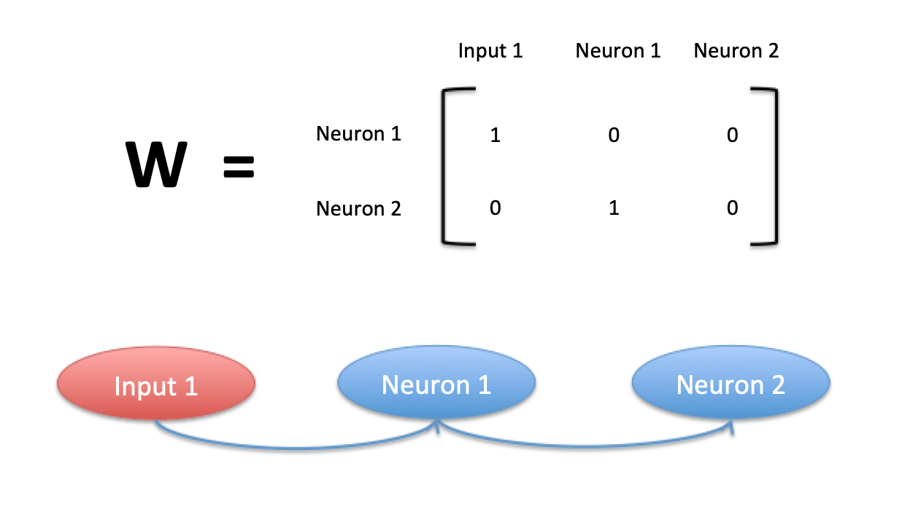
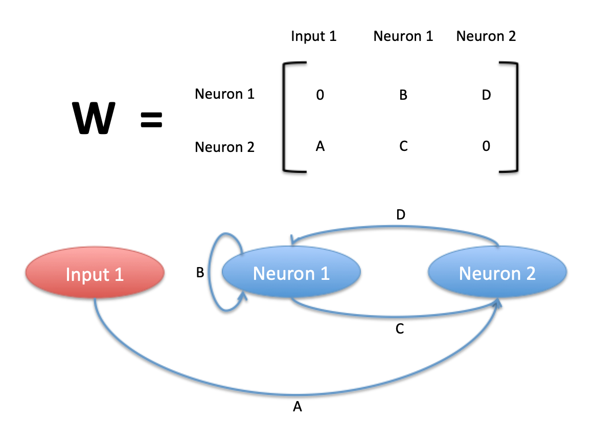
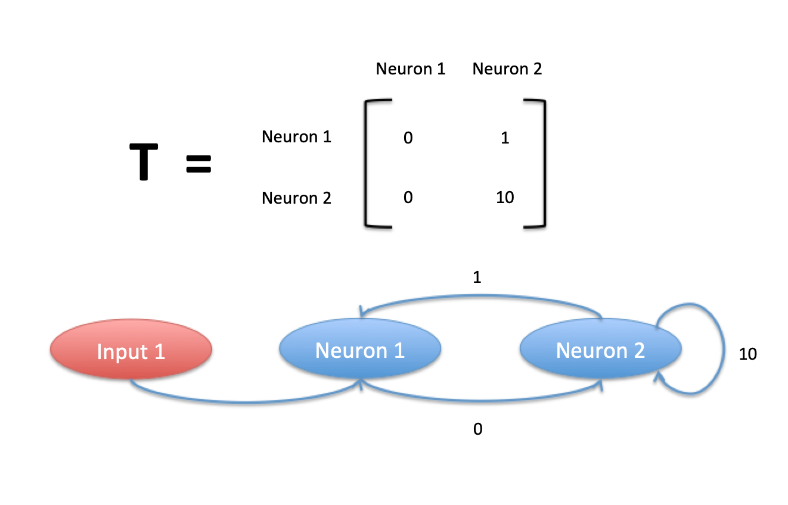

## Network:
A Network is a specific topology of connected Neuron objects. Connections between neurons can be weighted, and also can carry a time delay. There can be multiple input sources, which can be connected to any neurons. These connections also have associated weights and time delays. 

Once initialized, a Network's primary method is to take in a set of signals at a given timestep and reveal the updated neuron states. 

### Defining connections

A network can be thought of as a system of inputs and outputs. 

To construct your W matrix, consider the examples in the following images. 

Each row corresponds to a neuron. Each column corresponds to an input source, with the raw inputs coming first and the neurons coming second. The element of W in row i and column j should be interpreted as "neuron i gets its input from input-source j". 

The time delay matrix is simpler. In a similar way, the element of T in row i and column j should be interpreted as "neuron i gets its input from neuron j".

